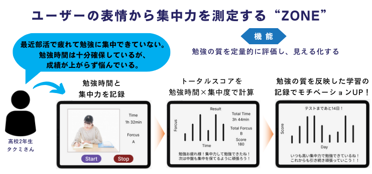
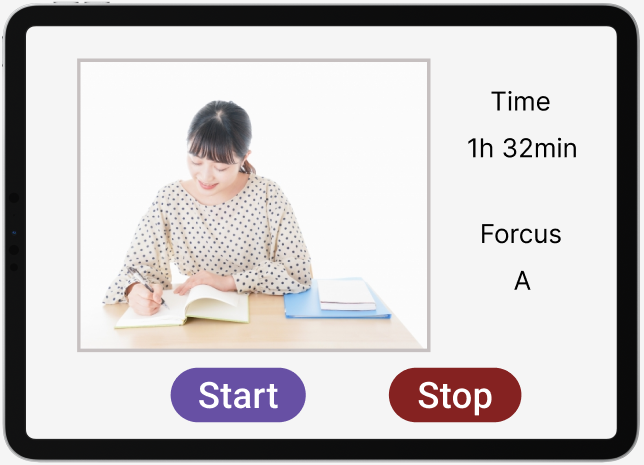
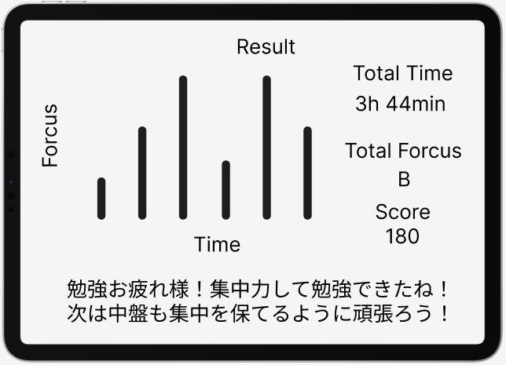
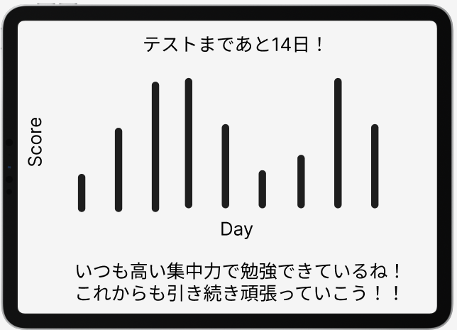

# ZONE



## アプリ起動方法
```
https://github.com/yutaimai1126/zone.git    # このリポジトリをクローン

python -m venv .venv    # 仮想環境を作成

. .venv/bin/activate         # 仮想環境をアクティベート(Linux,Macの場合)

.\.venv\Scripts\activate    # 仮想環境をアクティベート(Windowsの場合)

pip install requirements.txt    # 必要なライブラリをインストール

streamlit run streamlit_app.py     # アプリを起動(ローカルサーバー)
```

## 想定エンドユーザー
部活と勉強を両立させたい高校２年生のタクミさん

タクミさんは、地元の偏差値60の公立高校（普通科）に通い、野球部に所属しています。平日は19時まで練習があり、土日は一日中練習や練習試合で忙しく過ごしています。入学当初、成績は優秀で、担任の先生からも難関校を目指せると期待されていました。しかし、野球部の練習が本格化してからは、部活動の疲れから家に帰っても予習や宿題を終えないまま寝てしまう日が増え、次第に授業の進度についていけなくなってしまいました。2年生になってからは一気に成績が下がり、定期テストでは赤点を取ることもありました。

現状を打開するために、タクミさんは2年生の2学期初めから、友達に勧められた「**StudyCast**」を使って勉強記録をつけ始めました。このアプリでは、リア友やアプリ内の勉強仲間と一緒に勉強することができ、モチベーションを上げられています。みんなと一緒に作業することでやる気が出るタクミさんには、ぴったりのアプリです。しかし、最近は部活動の疲れが影響し、オンラインルームで勉強中にうとうとしてしまったり、集中力が続かない時間が増えてきています。そのため、夜遅くまで勉強しても宿題が終わらないことがあり、授業の進度にもまだ追いつけていません。3学期末のテストまであと1ヶ月しかなく、野球部の冬練で疲労が溜まっていますが、なんとか良い点を取るために頑張りたいと思っています。

## エンドユーザーの課題
勉強の質を高めることができていない

タクミさんが授業の進度についていけない原因は「時間的・体力的な制約による勉強量の減少」である。タクミさんは部活の影響で放課後や土日の勉強時間が減った上に、体力的にも余裕がない。タクミさんが部活も頑張りつつ、勉強も高い成績を維持するためには、勉強の質を高める必要がある。タクミさんは「StudyCast」で勉強のモチベーションを維持できているが、肝心の「勉強の質を高める」ことができていない。

## 解決策
勉強の質を定量的に評価し、見える化する

「StudyCast」は勉強時間を記録しつつ、勉強仲間とモチベーションを高め合う機能がある。しかし、勉強時間中の集中度、すなわち勉強の質を測定する機能はない。そのため、勉強中に集中していなくても記録には残らない。そこで、タクミさんが集中して勉強するように意識付けるために、勉強の質を定量的に評価・記録する。これによって、勉強仲間が集中して勉強していることがわかり、勉強に集中するモチベーションになる。さらに、ダラダラ勉強していることを反省するきっかけにもなる。

# サービス
StudyCastの追加機能：ユーザーの表情と姿勢をもとに集中力を測定する「ZONE(ゾーン)」
ユーザーがオンラインルームに入っている時、スマホカメラで顔・上半身を撮影し続け、機械学習を用いて表情と姿勢を推定する。
推定結果から集中力に関わる特徴量から集中スコアを計算する。
集中スコアと勉強時間の積を記録する。





